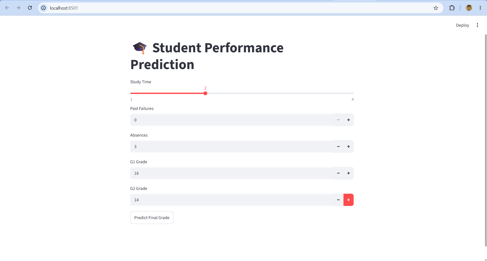
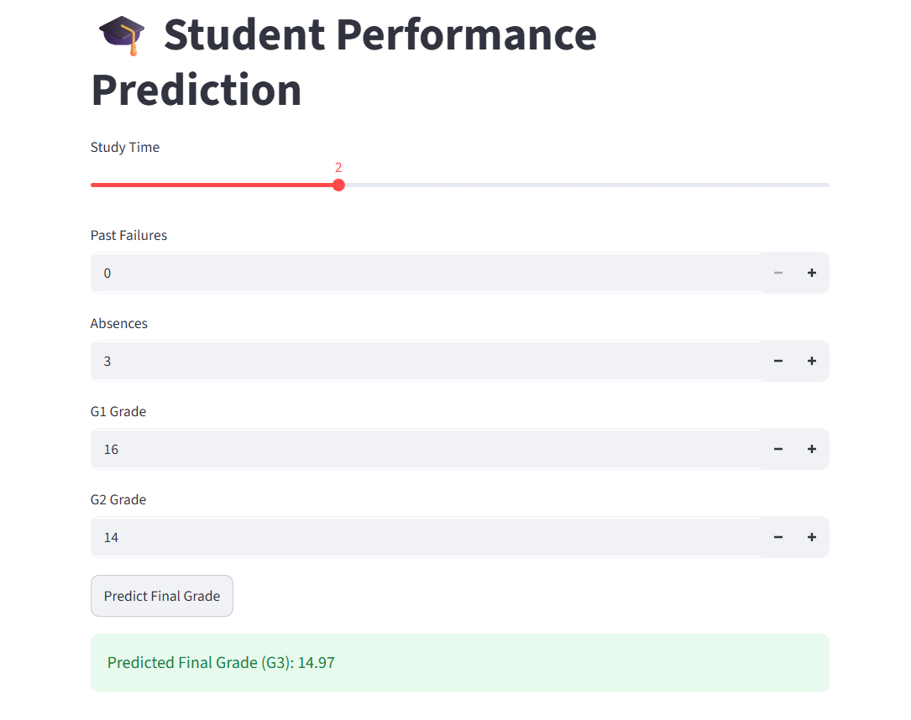

# Student-Performance-Prediction
## Overview
A machine learning project that predicts a student's final grade (G3)
based on study time, failures, absences, G1, and G2 grades.

## Technologies
- Python
- Pandas
- Scikit-Learn
- Streamlit
- Matplotlib

## Features
- Data Preprocessing
- Feature Engineering
- Random Forest Regression
- Real-Time Prediction
- Interactive Streamlit UI

## Project Structure
Student-Performance-Prediction
├── data
├── models
├── src
├── app.py
├── requirements.txt
├── README.md
└── screenshots

## How to Run
pip install -r requirements.txt
streamlit run app.py

## Screenshots

